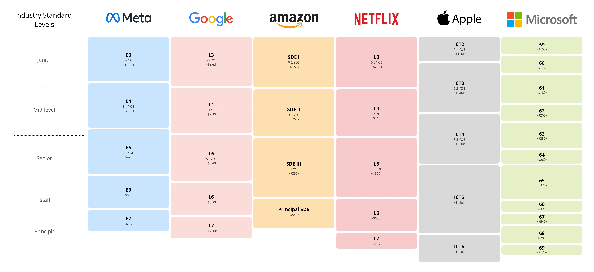

<meta http-equiv="refresh" content="0; url=https://homun.posetmage.com/SystemDesignInterview/en" />

## Discord
[Mock System Design Interview](https://discord.gg/WHjarsrCvK) - Finding Partners here

## Introduction

During the early 2000s to mid-2010s, unconventional interview questions became a hallmark of not only tech companies like Google but also universities aiming to identify top talent. Questions such as the famous "Google Intern Movie" blender question or the "How many ping-pong balls can fit in a plane?" were not intended to test specific technical skills. Instead, they focused on evaluating problem-solving abilities, creativity, logical reasoning, and how individuals approached open-ended challenges.

By the late 2010s, tech companies began moving away from abstract brainteasers, finding them ineffective at predicting real-world success. Instead, they adopted structured processes that are still widely used today, including:
* **take-home assignments** : to assess practical skills 
* **system design interviews** : for evaluating architectural thinking
* **behavioral questions (BQ)** : to gauge interpersonal abilities and cultural fit.

This modern approach balances technical expertise with problem-solving and teamwork skills. Usually for L4~L6+: 

## Books

* System Design Interview – An insider's guide by Alex Xu 
* Designing Data-Intensive Applications by Martin Kleppmann 

Many people recommend the Grokking the System Design Interview course as an introduction. Although this course is relatively simple, it is the best beginner material, as it repeatedly guides students through the essential steps of a system design interview.

Alex's book is a must-read, as it helps readers understand that system design is an iterative process, preventing them from falling into the "problem-solving mindset" of jumping straight into writing a complex architecture.

DDIA is a legendary book; if you can read it multiple times, do so. It covers almost all the crucial trade-offs in system design.

Other resources, such as [InfoQ](https://www.youtube.com/@infoq), are also great to watch as much as possible. Additionally, various big companies' blogs often discuss the architectures they are currently using.

## Youtube 
* Search "Mock System Design Interview"
* Search "System Design Interview"
* [System Design Interview](https://www.youtube.com/@SystemDesignInterview/videos)

## Github
* [System Design Primer](https://github.com/donnemartin/system-design-primer)
* [Grokking the System Design Interview](https://github.com/sharanyaa/grok_sdi_educative)

## [中文資源](/zh/)
